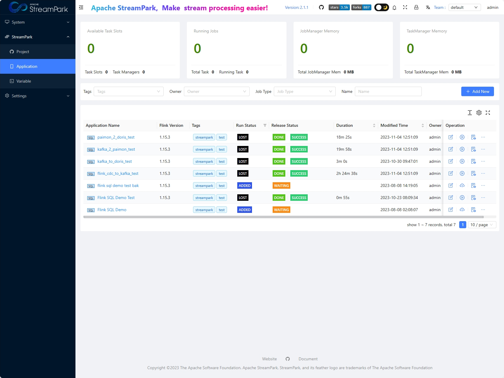
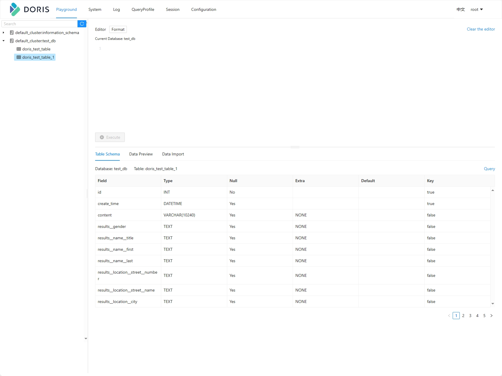
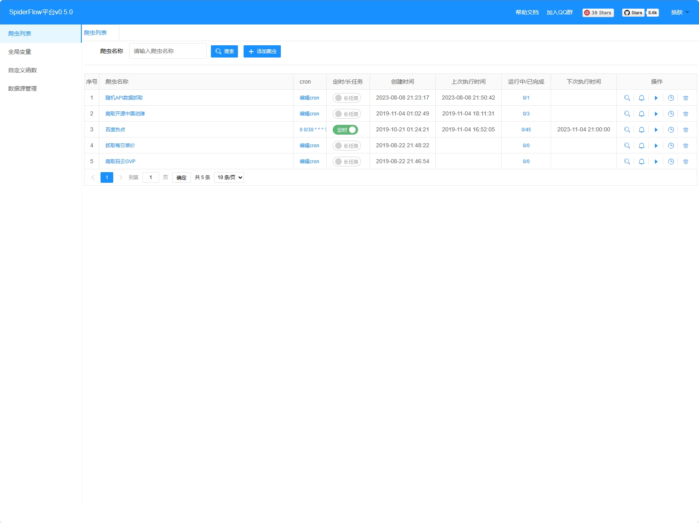
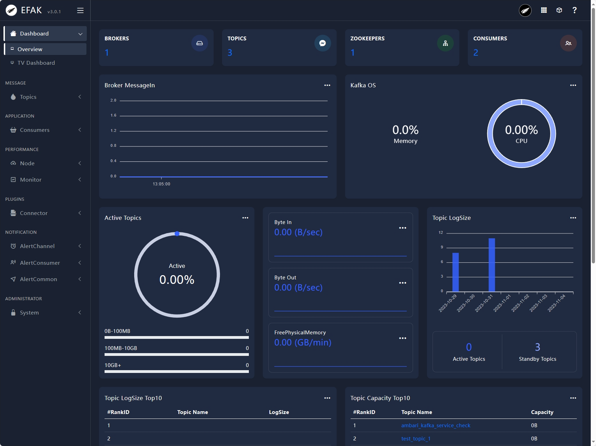
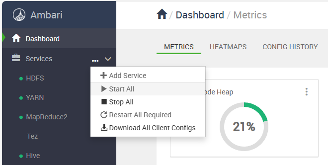

# PROJECT NOAH

项目名称灵感来自于诺亚方舟。

本项目旨在为数据开发人员提供一个简单的，紧跟技术发展趋势的一站式学习与测试环境。

如果有之前使用过 CDH-quickstart-VM 的朋友，那么，对，就是类似的玩意。

本文档分为如下几部分：

* 一、您能从项目中获得什么环境？
* 二、需要什么前置条件？
* 三、如何启动？
* 四、后续规划
* 五、后记
* 附1：各组件访问 url 及用户名密码
* 附2：上述组件的官网

## 一、您能从项目中获得什么环境？

### 1、ambari 2.8.0 的全部组件（对应 bigtop 3.2.0 的组件栈），包含：

| Service        | Version  | Description                                                                                                                                                                                 |
| -------------- | -------- | ------------------------------------------------------------------------------------------------------------------------------------------------------------------------------------------- |
| HDFS           | 3.3.4-1  | Apache Hadoop Distributed File System                                                                                                                                                       |
| YARN           | 3.3.4-1  | Apache Hadoop NextGen MapReduce (YARN)                                                                                                                                                      |
| MapReduce2     | 3.3.4-1  | Apache Hadoop NextGen MapReduce (YARN)                                                                                                                                                      |
| Tez            | 0.10.1-1 | Tez is the next generation Hadoop Query Processing framework written on top of YARN.                                                                                                        |
| Hive           | 3.1.3-1  | Data warehouse system for ad-hoc queries & analysis of large datasets and table & storage management service                                                                                |
| HBase          | 2.4.13-1 | Non-relational distributed database and centralized service for configuration management & synchronization                                                                                  |
| ZooKeeper      | 3.5.9-2  | Centralized service which provides highly reliable distributed coordination                                                                                                                 |
| Ambari Metrics | 3.0.0    | A system for metrics collection that provides storage and retrieval capability for metrics collected from the cluster                                                                       |
| Kafka          | 2.8.1-2  | A high-throughput distributed messaging system                                                                                                                                              |
| Spark          | 3.2.3-1  | Apache Spark is a unified analytics engine for large-scale data processing.                                                                                                                 |
| Zeppelin       | 0.10.1-1 | A web-based notebook that enables interactive data analytics. It enables you to make beautiful data-driven, interactive and collaborative documents with SQL, Scala and more.               |
| Flink          | 1.15.3-1 | Flink is a framework and distributed processing engine for stateful computations over unbounded and bounded data streams NOAH 的flink 环境中已经包含了 paimon 0.5.0 和 flink CDC 2.4.0 |
| Solr           | 8.11.2-1 | Solr is the popular, blazing-fast, open source enterprise search platform built on Apache Lucene.                                                                                           |

### 2、流任务管理平台 streampark 2.1.1

### 3、OLAP 引擎 doris 1.2.4.1

### 4、图形化配置式爬虫平台 spiderflow 0.5.0

### 5、Kafka 管理平台 EFAK 3.0.1

## 二、需要什么前置条件？

你需要一个 docker 环境（建议给到充裕一些的内存容量，本人测试容器内存为48G）

## 三、如何启动？

### STEP 1 拉取镜像

docker pull registry.cn-hangzhou.aliyuncs.com/wujundi/share:noah-milestone-1-20231225

### Step 2 运行容器

docker run -itd --name='noah' --hostname='noah' -e TZ=Asia/Shanghai -p 8042:8042 -p 3306:3306 -p 2929:2929 -p 8000:8000 -p 8080:8080 -p 50070:50070 -p 8088:8088 -p 19888:19888 -p 3000:3000 -p 10002:10002 -p 16010:16010 -p 18081:18081 -p 9995:9995 -p 8082:8082 -p 8983:8983 -p 8440:8440 -p 8441:8441 -p 9092:9092 -p 4040:4040 -p 4041:4041 -p 9000:9000 -p 10086:10086 -p 5432:5432 -p 8081:8081 -p 18030:18030 -p 19020:19020 -p 19030:19030 -p 19010:19010 -p 19050:19050 -p 19060:19060 -p 18040:18040 -p 18060:18060 -p 18088:18088 -p 2181:2181 -p 18048:18048 -p 18085:18085 -p 8020:8020  --privileged registry.cn-hangzhou.aliyuncs.com/wujundi/share:noah-milestone-1-20231225

### Step 3 进入容器

具体方式因人而异，个人推荐使用 vscode 的 Dev Containers 插件，能兼顾图形化文件目录和终端指令，可以提高学习效率。

### Step 4 开启后端服务

在容器中执行 bash /opt/start_up.sh

### Step 5 启动 ambari 内的各个组件

浏览器访问 http://127.0.0.1:8080/#/login，Username 输入 admin，Password 输入 admin，登录之后，在左侧 Service 后面的三个点中，点击【Start All】，等待组件各组件启动

### Step 6 启动完成，欢迎玩耍

## 四、后续规划

1、Stream WareHouse 流式数仓的构建、资源占用与性能、可行性调研。

2、离线调度平台  dolphinscheduler（离线调度平台大家应该见的多了，所以这个不是 NOAH 的主要方向）

## 五、后记

作为一位数仓同学，深知这个岗位对基础设施的依赖。

恰逢数据湖正在蓬勃发展，流式数仓有望颠覆传统数据处理模式，倍感焦虑，于是使出了吃奶的劲攒出了这么一套环境。

然而个人水平有限，难免坐井观天，还望大家多多指点，多多提携，感谢感谢。

工作繁忙加之广告盛行，烦请您备注来自NOAH项目，不胜感激。

## 附1：各组件访问 url 及用户名密码

| 组件       | 访问地址                                           | 用户名 | 密码                             |
| ---------- | -------------------------------------------------- | ------ | -------------------------------- |
| Ambari     | http://127.0.0.1:8080/#/login                      | admin  | admin                            |
| StreamPark | http://127.0.0.1:10086/#/login?redirect=/flink/app | admin  | streampark                       |
| Doris      | http://127.0.0.1:18030/home                        | root   | 没有密码，输入用户名之后登录即可 |
| SpiderFlow | http://127.0.0.1:18088/                            |        | 不需要登录                       |
| EFAK       | http://127.0.0.1:18048/                            | admin  | 123456                           |

环境中使用的个人代码都在 /OPT 目录中，欢迎查看，欢迎指正。

## 附2：上述组件的官网

感谢所有的这些开源大数据组件以及他们的参与者

[Ambari - (apache.org)](https://ambari.apache.org/)

[Bigtop – Apache Bigtop](https://bigtop.apache.org/)

[Apache StreamPark (incubating) | Apache StreamPark (incubating)](https://streampark.apache.org/zh-CN/)

[Apache Doris: Open-Source Real-Time Data Warehouse - Apache Doris](https://doris.apache.org/zh-CN/)

[EFAK (kafka-eagle.org)](https://www.kafka-eagle.org/)

[Apache Paimon](https://paimon.apache.org/)

[CDC Connectors for Apache Flink® (ververica.github.io)](https://ververica.github.io/flink-cdc-connectors/)
